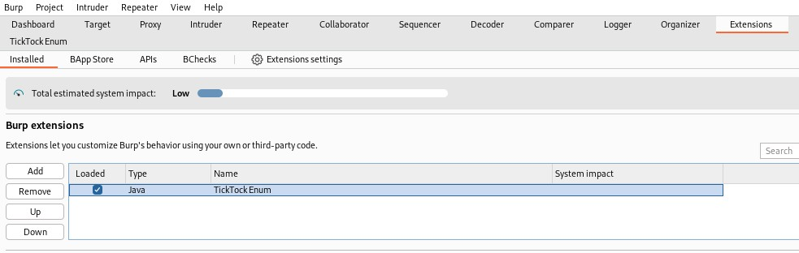
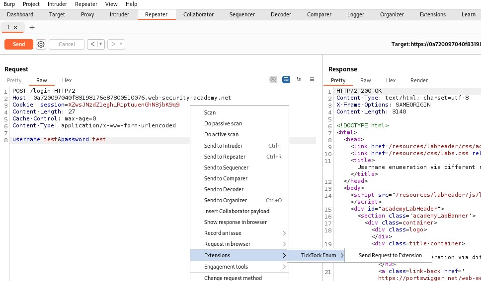
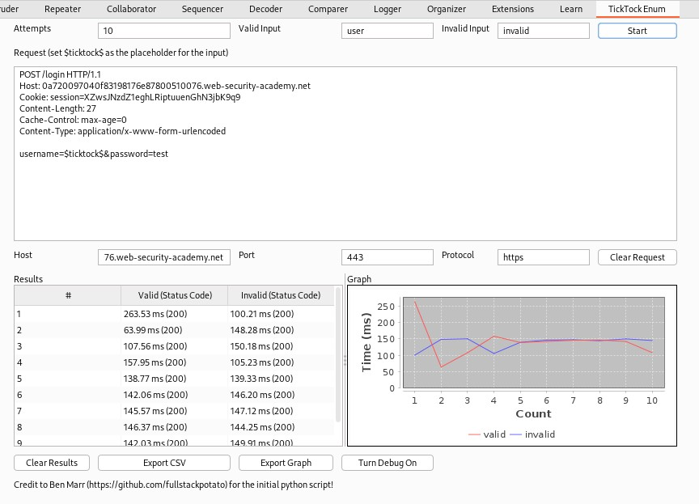

# TickTockEnum
Enumeration via side channel (timing) Burp Extension. 

The extension can be used for various time based enumeration checks. For example username enumeration where there is a discrepancy between the response time for valid and invalid usernames. While this can generally be tested manually or with Intruder, the extension provides output, such as a graph that can be included in a pentest report.


## Credits

Credits to [Ben Marr](https://github.com/fullstackpotato) for the initial python script.

I created this extension as part of my work at [PTP](https://pentestpartners.com), who gave me dev time to make this.


## Extension

The project was created with Java JDK 21 (Burp Suite compatibility) and Gradle 8.10.


### Build from Source

If you want to make changes to the code then clone the repository and build the project with:

```
gradlew clean shadowJar
```


### Release

The extension is a jar file and all required libraries (JFreeChart) are packaged within. Therefore, the extension can just be added as is in the Burp Extensions tab.


## How it works

In Burp, just send a request to the extension through the context menu and configure the request as follows:

- Make sure there request uses HTTP 1.1.
- Set a known valid and a known invalid input in the respective fields.
- Set the placeholder, `$ticktock$`, where the data should be replaced.
- Set the number of requests that should be sent for each value.

And then hit start.


If you are testing a login form, make sure to set an **invalid password** for both the valid and invalid user you provided. The extension will then run a set of requests (defined in the "Attempts" field) per input and show the results in table and graph form. 

The graph is generated with JFreeChart which is packaged together with the extension Jar through a plugin (see Gradle file).

The requests are sent in a single thread to ensure the most accurate response time. 

**Note:** beware of account lockouts when testing!


### Settings

| Setting           | Info                                                         |
| ----------------- | ------------------------------------------------------------ |
| **Attempts**      | Number of requests to be sent. Note: Beware of possible account lockouts if you are sending a login request! |
| **Valid Input**   | A valid value to test against. Should already be in the format that's required. The extension won't do any encoding before placing the value into the request. |
| **Invalid Input** | Set a known invalid value. Should already be in the format that's required. The extension won't do any encoding before placing the value into the request. |
| **Request**       | Set `$ticktock$` where the parameter you want to enumerate should be. |
| **Host**          | Will either be populated when you send a request from Repeater or the History to the extension, but can also be set manually. Example format: google.com |
| **Port**          | Will either be populated when you send a request from Repeater or the History to the extension, but can also be set manually. |
| **Protocol**      | Will either be populated when you send a request from Repeater or the History to the extension, but can also be set manually. Should either be "https" or "http". |


### Actions

| Action        | Info                                                         |
| ------------- | ------------------------------------------------------------ |
| Start         | Start the enumeration with the configured values.            |
| Clear Request | Clears the "Request" text area.                              |
| Clear Results | Clears the "Results" table and Graph.                        |
| Export CSV    | Allows the user to export the results to a CSV file.         |
| Export Graph  | Allows the user to export the Graph as a JPG file.           |
| Turn Debug On | Toggle to enable debugging information in the Burb Extensions - Output tab. |


## Screenshots

**Add extension in Burp:**




**Send request to extension through the context menu:**




**Extension configuration and results:**



